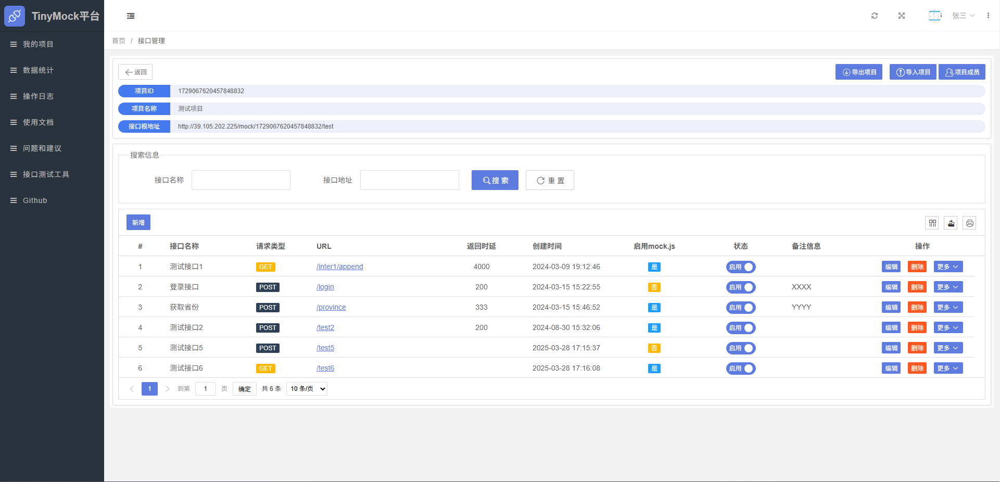

# Tiny Mock
# 一个基于SpringBoot开发的轻量级在线数据Mock平台


<a href="https://github.com/llllllxy/tiny-mock/stargazers"></a>
<a href="https://github.com/llllllxy/tiny-mock/network/members"></a>
<a href="https://github.com/llllllxy/tiny-mock/watchers"></a>
<a href="https://github.com/llllllxy/tiny-mock/issues"></a>
<a href="https://github.com/llllllxy/tiny-mock/blob/master/LICENSE"></a>

## 功能特色
- 快速生成演示数据，将请求根地址指向到模拟地址即可轻松实现接口模拟
- 支持项目管理，根据项目给接口分组，不同项目拥有不同的接口根地址
- 支持MockJs模拟，根据MockJs的强大能力进行数据生成，文档可见 [mockjs示例](http://mockjs.com/examples.html)
- 支持自定义Http响应码
- 支持模拟接口返回延时
- 支持项目接口数据的导出和导入，方便数据恢复备份
- 支持仪表盘功能，快速预览项目和接口运行调用情况
- 支持数据统计功能，查看每一个接口的调用分析数据
- 支持邀请码注册功能，方便团队内成员注册

## 主要技术选型

| 依赖                | 说明             |
|---------------------|--------------   |
| SpringBoot 2.6.13   | 基础框架         |
| Hikari              | 高性能数据库连接池 |
| MyBatis-Plus 3.5.6  | MyBatis的增强ORM |
| Redis               | 业务缓存、会话共享  |
| MySQL5.7            | 关系型数据库       |
| Layui               | 前端框架         |
| layuimini           | 前端模板         |


## 运行环境
- Jdk8
- MySQL5.6+
- Redis3.0+

## 运行启动教程
1. 新建`MySQL`数据库并导入`resources\init`文件夹下的数据库脚本
2. 修改配置文件中`application.yml`中数据库连接信息和Redis连接信息
3. 运行启动类`TinyMockApplication`，即可正常启动项目
4. 管理后台登录地址：`http://localhost:9019`  账户密码 `zhangsan / 123456`

## 平台功能
1、项目管理

2、主机管理

3、任务管理

4、任务执行日志

5、预警邮箱配置


## 功能界面展示

登录


注册


首页


我的项目


我的项目-新建


接口管理


接口管理-新增


接口管理-版本


接口管理-访问日志


数据统计


问题与建议


使用文档


## 其他
Mock.js 文档地址 http://mockjs.com/examples.html

## 项目计划
- 核心mock功能  `已完成`
- 项目管理  `已完成`
- 接口管理  `已完成`
- 接口修改历史  `已完成`
- 邀请码注册 `已完成`
- 首页大屏 `已完成`
- 接口访问日志查看  `已完成`
- Mock支持自定义Http状态码  `已完成`
- 数据统计页面 `已完成`
- 项目成员协作功能 `待完成`
- 导出项目，导入项目（项目级别的，方便数据备份和恢复） `已完成`
- 自定义头像修改 `已完成`

## 前后端分离部署（拿windows环境举例，linux下大同小异）
#### 1、将 `/resources/static/js/layuimini/miniAjax.js` 里的 `baseURL` 属性改为 `/back`


#### 2、按照 `nginx` 并更改配置
```editorconfig
    listen       8000;
    server_name  localhost;
    client_max_body_size 50M;

    # 前端文件的实际路径部署，实际路径在D:\nginxplace\mock 
    location / {
      root   D:/nginxplace/mock;
      index  index.html index.htm;
    }

     # 后端反向代理，其中 /back 和 miniAjax.js 里的 baseURL 属性对应
    location /back/ {
      proxy_pass  http://127.0.0.1:9019/;
      proxy_redirect off;
      # bForwarded-ForIP
      proxy_set_header  Host  $host:$server_port;
      proxy_set_header  X-Real-IP  $remote_addr;
      proxy_set_header  X-Forwarded-For  $proxy_add_x_forwarded_for;
      proxy_next_upstream error timeout invalid_header http_500 http_502 http_503 http_504;
    }
```

#### 3、将 `/resources/static` 目录下的内容 全部复制到 `D:\nginxplace\mock` 目录下，此目录和 nginx 的 location.root 路径配置保持一致


#### 4、刷新nginx配置 `nginx.exe -s reload`，即可访问 `http://localhost:8000/`