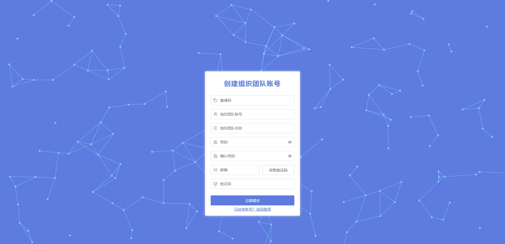
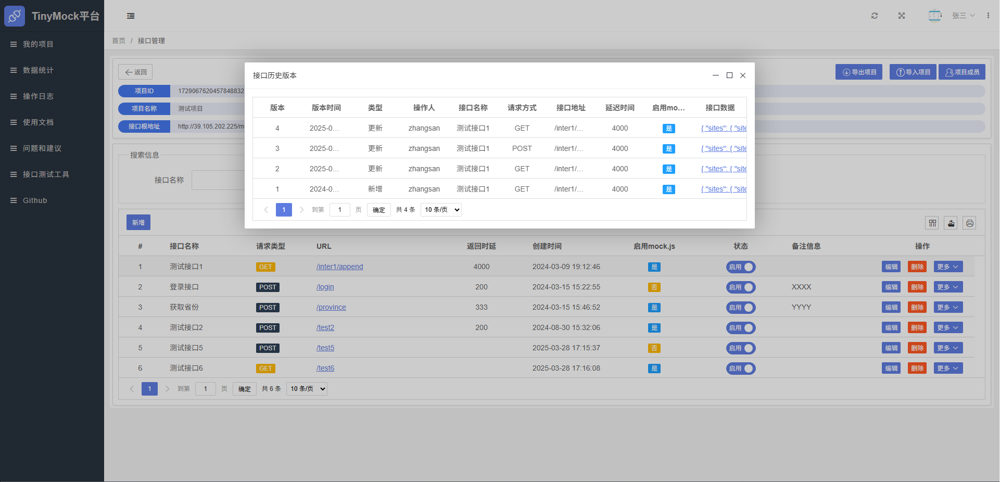
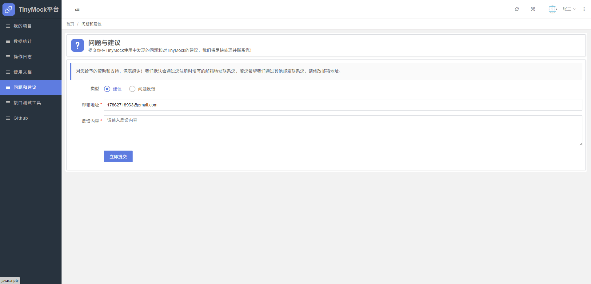
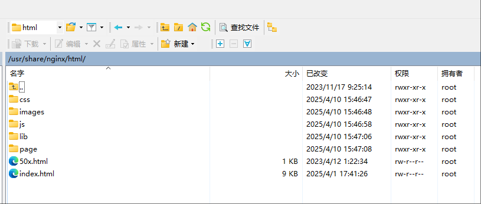

# Tiny Mock
# 一个基于SpringBoot开发的轻量级在线数据Mock平台


<a href="https://github.com/llllllxy/tiny-mock/stargazers"></a>
<a href="https://github.com/llllllxy/tiny-mock/network/members"></a>
<a href="https://github.com/llllllxy/tiny-mock/watchers"></a>
<a href="https://github.com/llllllxy/tiny-mock/issues"></a>
<a href="https://github.com/llllllxy/tiny-mock/blob/master/LICENSE"></a>

## 功能特色
- 快速生成演示数据，将请求根地址指向到模拟地址即可轻松实现接口模拟
- 支持项目管理，根据项目给接口分组，不同项目拥有不同的接口根地址
- 支持MockJs模拟，根据MockJs的强大能力进行数据生成，文档可见 [mockjs示例](http://mockjs.com/examples.html)
- 支持自定义Http响应码
- 支持模拟接口返回延时
- 支持项目接口数据的导出和导入，方便数据恢复备份
- 支持成员协作功能，同一项目可以邀请多人进行协助
- 支持仪表盘功能，快速预览项目和接口运行调用情况
- 支持数据统计功能，查看每一个接口的调用分析数据
- 支持邀请码注册功能，方便团队内成员注册
- 全局基于国密算法的登录验证和数据保护体系，保证账户安全

## 主要技术选型

| 依赖                 | 说明            |
|--------------------|---------------|
| SpringBoot 3.3.10  | 基础框架          |
| Hikari             | 高性能数据库连接池     |
| MyBatis-Plus 3.5.8 | MyBatis的增强ORM |
| Redis              | 业务缓存、会话共享     |
| MySQL 5.7          | 关系型数据库        |
| Layui 2.9.15       | 前端框架和模板       |
| Mock.js 1.0.0      | 数据mock引擎      |

## 运行环境
- Jdk21
- MySQL5.6+
- Redis3.0+

## 运行启动教程
1. 新建`MySQL`数据库并导入`resources\init`文件夹下的数据库脚本
2. 修改配置文件中`application.yml`中数据库连接信息和Redis连接信息
3. 运行启动类`TinyMockApplication`，即可正常启动项目
4. 管理后台登录地址：`http://localhost:9019`  账户密码 `zhangsan / 123456`

## 项目结构

```
tiny-mock
│
├─resources 资源模块
│  │
│  ├─init  系统初始化脚本
│  │  
│  ├─mapper mybatis的xml文件 
│  │  
│  └─static 静态资源
│      │   
│      ├─css 样式表资源
│      │   
│      ├─images 图片资源
│      │   
│      ├─js js公共文件封装
│      │   
│      ├─lib js公共库
│      │   
│      ├─page 页面资源
│      │   
│      └─index.html 系统入口页面
│
├─java 后台模块
│  │
│  ├─common  公共模块
│  │   │   
│  │   ├─annotation 公共注解
│  │   │   
│  │   ├─config 系统配置
│  │   │   
│  │   ├─constants 系统常量
│  │   │   
│  │   ├─enums 系统枚举 
│  │   │   
│  │   ├─exception 系统自定义异常
│  │   │   
│  │   ├─model 公共数据模型
│  │   │   
│  │   └─utils 工具类
│  │
│  └─modules  业务模块
│      │   
│      ├─bean bean对象 
│      │    │      
│      │    ├─dto 参数对象
│      │    │      
│      │    ├─vo 视图对象
│      │    │      
│      │    ├─enums 业务枚举
│      │    │
│      │    └─entity 实体类   
│      │   
│      ├─helper 业务工具类
│      │ 
│      ├─web 控制层
│      │            
│      ├─service 服务层
│      │   
│      └─mapper 持久层
└─

```


## 平台功功能界面展示

登录


注册


首页


我的项目


我的项目-新建


接口管理


接口管理-新增


接口管理-版本


接口管理-访问日志


接口管理-成员协助


数据统计


操作日志


问题与建议


接口测试工具


使用文档


## 其他
Mock.js 文档地址 http://mockjs.com/examples.html

## 项目计划
- Mock核心功能  `已完成`
- 项目管理  `已完成`
- 接口管理  `已完成`
- 接口修改历史  `已完成`
- 接口访问日志  `已完成`
- 租户邀请码注册 `已完成`
- 租户密码找回 `未完成`
- 租户首页大屏 `已完成`
- 租户数据统计页面 `已完成`
- 项目成员协作功能 `已完成`
- 项目导出，项目导入（项目级别的，以便数据备份和恢复） `已完成`
- 自定义头像修改 `已完成`
- 接口分模块管理 `未完成`
- 租户操作日志记录功能 `已完成`
- 租户操作日志查询功能 `已完成`

## 前后端分离部署示例（以linux环境举例）
#### 1、将 `/resources/static/js/layuimini/miniAjax.js` 里的 `baseURL` 属性改为 `/back`


#### 2、安装 `nginx` 并更改配置 `nginx.conf`
```editorconfig
    listen       80;
    server_name  localhost;
    client_max_body_size 50M;

    # 前端文件的实际路径部署，实际路径在D:\nginxplace\mock 
    location / {
      root   /usr/share/nginx/html;
      index  index.html index.htm;
    }

     # 后端服务反向代理，其中 /back 和 miniAjax.js 里的 baseURL 属性对应
    location /back/ {
      proxy_pass  http://127.0.0.1:9019/;
      proxy_redirect off;
      # bForwarded-ForIP
      proxy_set_header  Host  $host:$server_port;
      proxy_set_header  X-Real-IP  $remote_addr;
      proxy_set_header  X-Forwarded-For  $proxy_add_x_forwarded_for;
      proxy_next_upstream error timeout invalid_header http_500 http_502 http_503 http_504;
    } 
                                                                                  
      # mock地址反向代理，其中 /mock 和 核心mock地址对应
    location /mock/ {
      proxy_pass  http://127.0.0.1:9019/mock/;
      proxy_redirect off;
      # bForwarded-ForIP
      proxy_set_header  Host  $host:$server_port;
      proxy_set_header  X-Real-IP  $remote_addr;
      proxy_set_header  X-Forwarded-For  $proxy_add_x_forwarded_for;
      proxy_next_upstream error timeout invalid_header http_500 http_502 http_503 http_504;
    }

```

#### 3、将 `/resources/static` 目录下的内容 全部复制到 `/usr/share/nginx/html` 目录下，此目录和 nginx 的 location.root 路径配置保持一致


#### 4、刷新nginx配置 `nginx -s reload`，然后即可访问 `http://localhost`